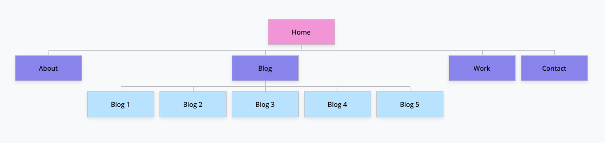
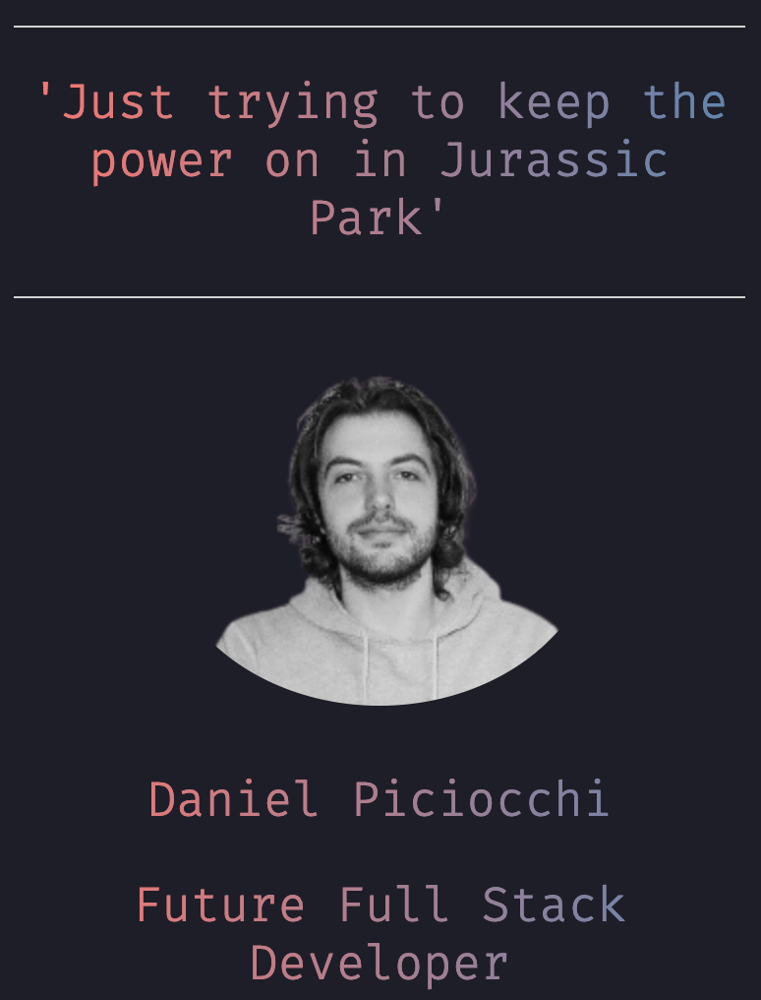
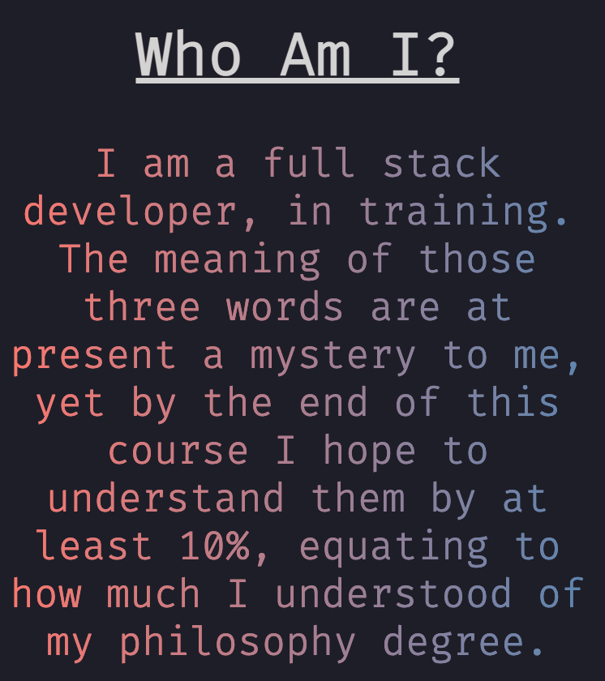
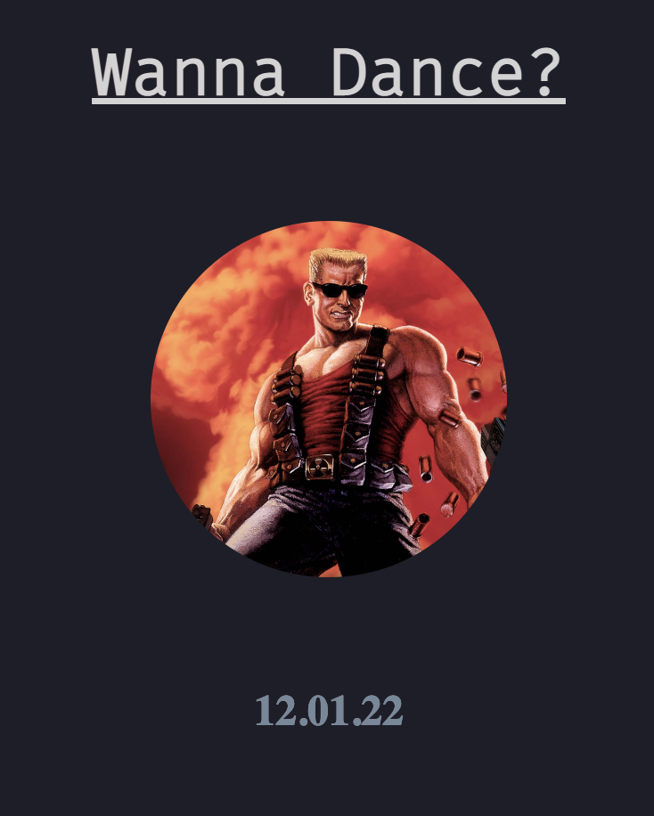
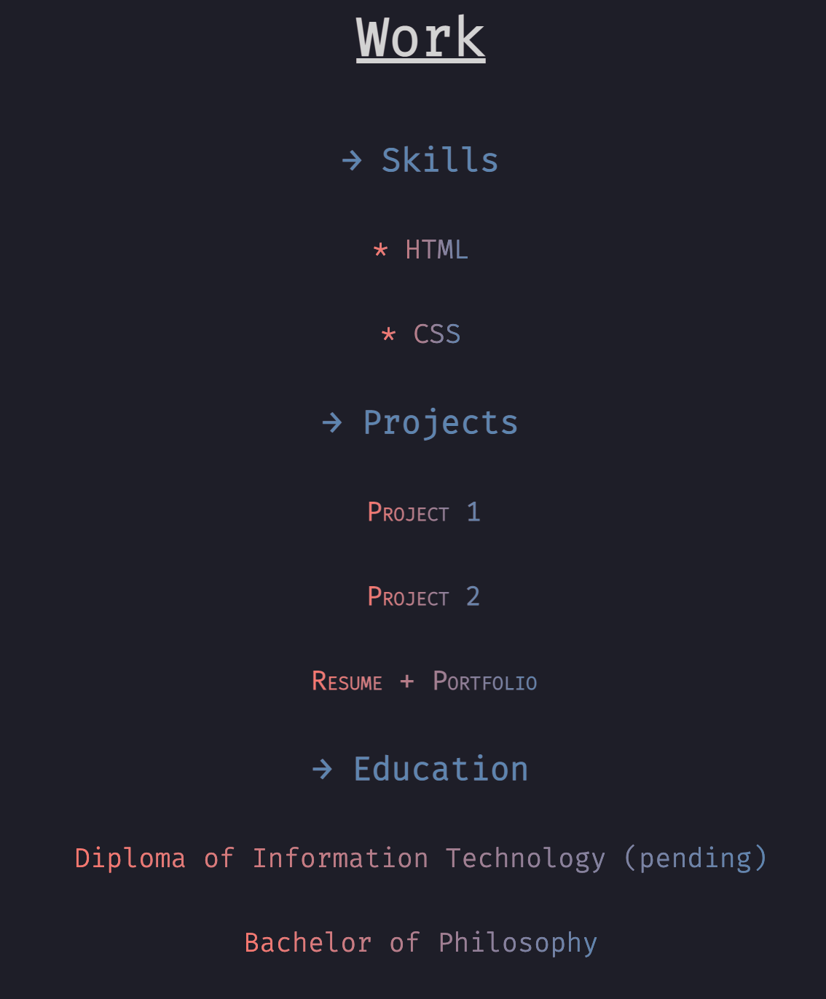
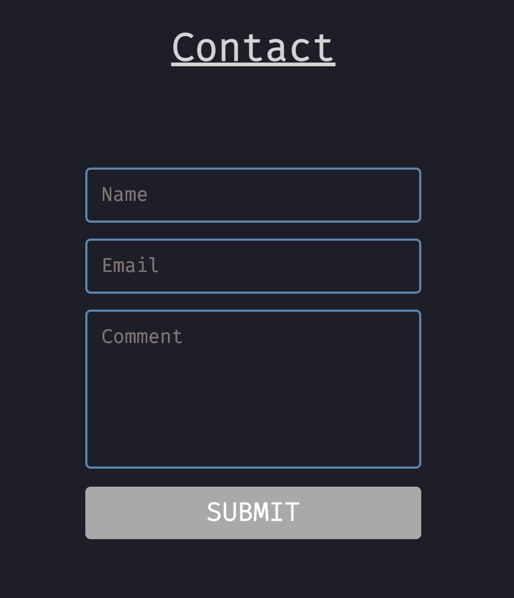

# Portfolio - Entry Level Website

A website created from scratch using introductory to web development tools html and CSS.

# Table of Contents

- Website
- Github
- Description
- Presentation
- Target Audience
- Tech Stack

#  Website

Link to the latest version of the website:

(https://www.danielpiciocchi.com/)

# GitHub

Link to the GitHub repositroy:

https://github.com/Daniel-Piciocchi/Portfolio

# Description

The intention of this project was to build and display a user-friendly website, using html and css, to reflect web development skills learned in class. The following is a sitemap overview:

## Home Page

All pages of the site contains a logo/home button in the top left hand corner of 
the header, and four navigation links, 'About', Blog', 'Work', 'Contact', across the top right, 
(when using larger devices and desktops): 

and a hidden hamburger menu (when using devices 
with smaller screens): 

for easy navigation between pages depending on the device being used.

The content in the centre of the page includes an image of the student, with a quote, and brief intro:

In addition, the home page contains a fixed footer with 3 icons that link to a personal github, linkedin, and a personal email:

## About Page

The about page contains a brief introduction to reflect the students personality and interests.

## Blog

The blog page contains several blogs that link to individual pages:

## Work

The work page has 3 subheadings, 'skills', 'projects', and 'education', that show the content inside on mobiles and smaller devices:

When using a desktop hovering over the subheadings reveals the content inside:

## Contact

The contact page displays a comment box where the user can input and submit their details:

Additionally, social media links are fixed to the bottom of the page:

## Presentation

(link to video)

## Target Audience 

The website was built for everyday users of both mobile and desktop applications that expect intuitive navigation with appealing visuals and easy to digest content that make for a seemless experience.

## Tech Stack
- HTML
- CSS
- Netlify 

